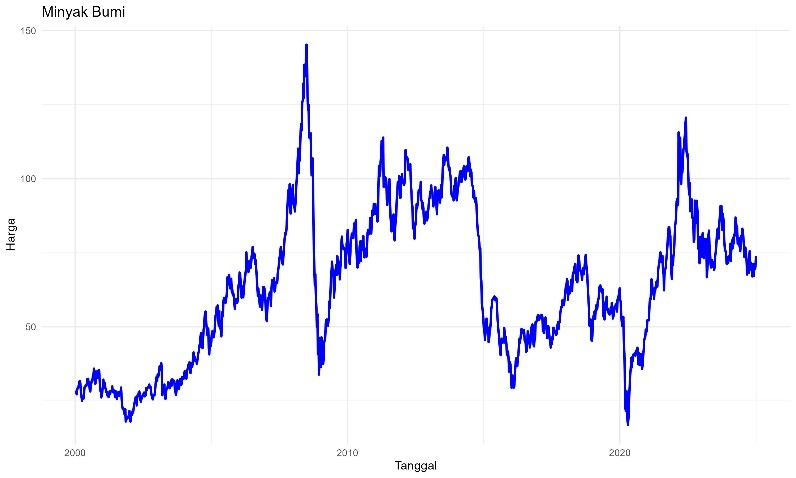
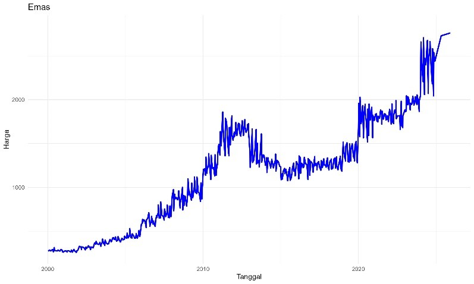

# SVR-Time-Series-Forecasting
Forecasting nonlinear time series data using Support Vector Regression (SVR)
## Tools
- R (e1071, caret, ggplot2)
- Excel for additional preprocessing
## Steps
1. Data preprocessing (Min-Max normalization, lag features)
2. Parameter optimization (Grid Search + Cross Validation)
3. Model training using RBF kernel
4. Evaluation (MSE, RMSE, MAE)
5. Future prediction (one-step forecasting)
## Dataset
- Dummy seasonal additive time series data (various patterns and lengths).
- Real-world datasets:
  - Crude oil price (monthly) : 
  - Gold price (monthly) : 
## Results Summary
- Oil price forecasting: RMSE = 0.0278, MAE = 0.0201
- Gold price forecasting: RMSE = 0.0165, MAE = 0.0119
- The SVR model with RBF kernel achieved stable and accurate predictions without signs of overfitting.
## Visualization
  
*Figure 1. SVR prediction vs actual oil prices*
  
*Figure 2. SVR prediction vs actual gold prices*

## Author
**Alfina Damayanti Putri**  
- LinkedIn: [linkedin.com/in/alfina](#)  
- Email: your.email@example.com

